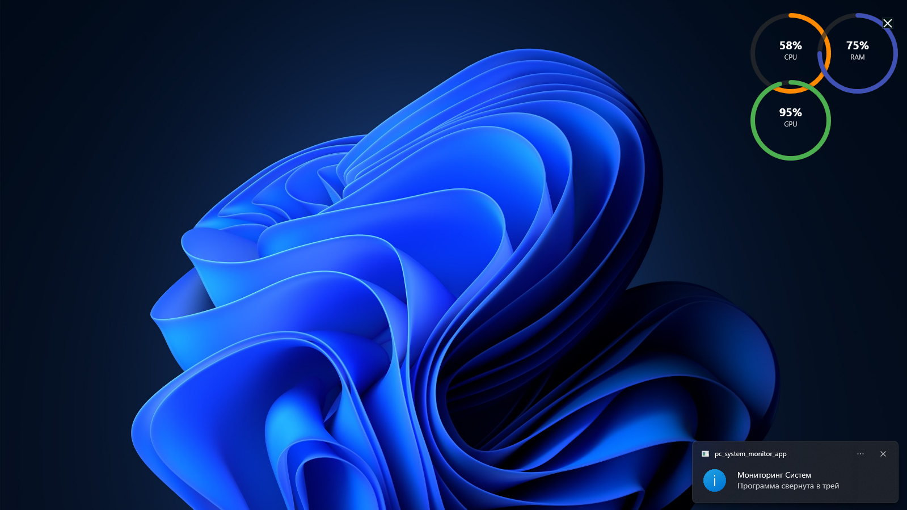

# PC System Monitor App 🖥️⚡  

**Дата:** 28.09.2025  

**Версия:** 1.0.0  
**Автор:** Rustem Emir-Veliyev  

Приложение для мониторинга состояния системы в реальном времени.  
Показывает загрузку **CPU, RAM, GPU** и позволяет закрепить мини-виджет поверх всех окон.  

---

## Возможности
- Просмотр текущей загрузки процессора и оперативной памяти  
- Мониторинг нагрузки GPU  
- Мини-виджет поверх всех окон включая игр
- Совместимость с Windows 10/11  

---

## Установка и запуск
Скачайте готовое приложение:  
[WINDOWS & Скачать PC System Monitor App Google Disk](https://drive.google.com/file/d/1lsGwmC9hbUPuS8e_civl-jlfU21iSijf/view?usp=sharing)

[WINDOWS & Скачать PC System Monitor App Github Release](https://github.com/emirveliyev/pc-system-monitor-app/releases/tag/v1.0.0-beta)

После распаковки запустите файл **SystemMonitoringApp.exe**  

---

## Лицензия
MIT — см. [LICENSE](./LICENSE)
